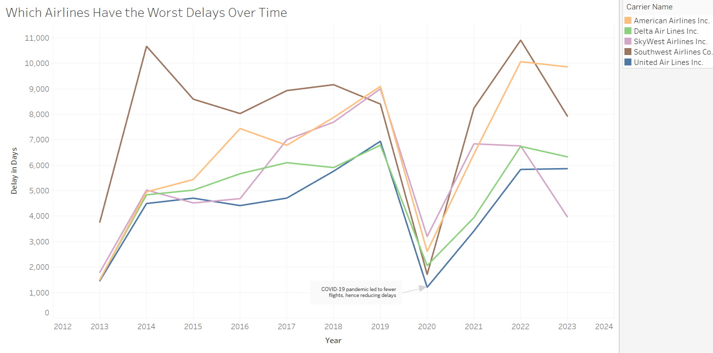
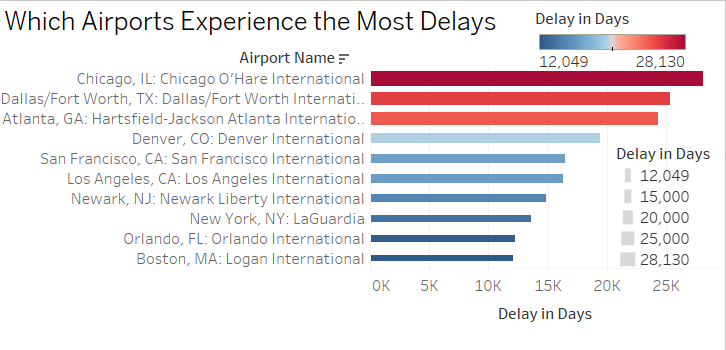
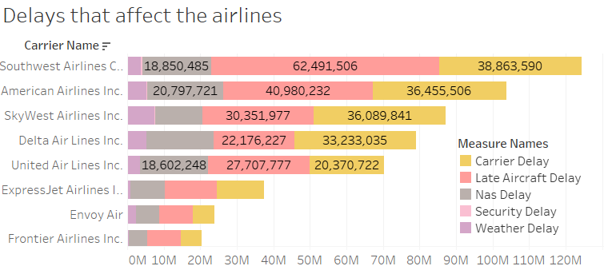
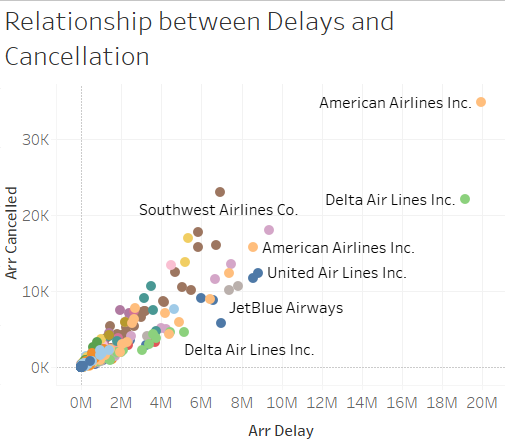
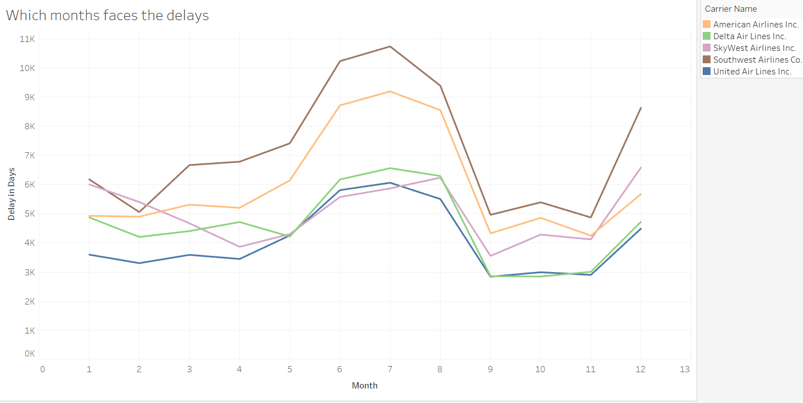

#  Airline Delay Analysis (2013–2023)

## About the Project
This project explores flight delay trends in the U.S. aviation industry over a 10-year period, analyzing key factors behind delays and cancellations. Inspired by a Newsweek article highlighting the most delayed airports in the U.S., the goal was to uncover real, data-backed insights using storytelling techniques and visualizations.

## A Passionate Data Storyteller
I am a data storyteller who believes that behind every dataset lies a compelling story waiting to be told.  
Through this project, I’ve combined data analytics and visual storytelling using Tableau to:
- Discover hidden patterns
- Make airline performance transparent
- Deliver clear, engaging insights to the audience

## Main Questions Explored
- Which airlines have the worst delay records over the years?
- Which airports consistently experience the most delays?
- What are the key reasons behind flight delays?
- Is there a strong relationship between delays and cancellations?
- When are delays at their highest throughout the year?

## Tools Used
- **Tableau** – For interactive dashboards and storytelling
- **Excel** – For data cleaning and preparation
- **Git** – For version control and project sharing

## Folder Structure
Airline-Delay-Analysis/ 
Airline_Delay_Cause.csv 
Images/ 
delays_by_airline.png 
airport_ranking.png 
delay_causes.png 
cancellations_vs_delays.png 
seasonal_trends.png 
README.md

## Article Reference
This project was inspired by:  
[Newsweek: The U.S. Airports With the Most Delays and Cancellations](https://www.newsweek.com/american-us-airports-most-delayed-flights-cancellations-survey-2014677)

## Sample Visuals

### Airline Delays Over Time

### Top Airports for Delays

### Delay Causes in Airlines

### Delays vs. Cancellations

### Seasonal Trends

## Learning Outcome
Through this project, I developed stronger skills in:
- Structuring data stories for real-world audiences
- Visualizing time-series and categorical data
- Communicating complex patterns clearly and visually

## Author
Neha Rajesh  
MS in Business Analytics  
[LinkedIn](https://www.linkedin.com/in/neha-rajesh-/)    
[Tableau Public](https://public.tableau.com/app/profile/neha.rajesh1307/vizzes)

